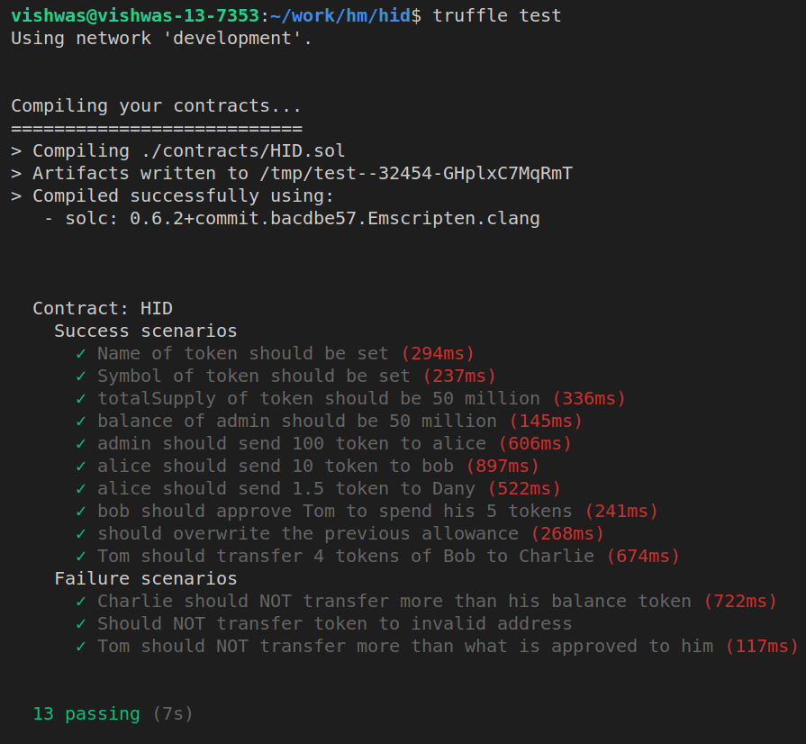

# HID

- Solidity version: `0.6.2`
- Node version: `v13.12.0`
- Truffle Version: `v5.2.0`

## Setup Project

### Private blockchain

```
ganache-cli -m <mnemonics>  # Run private blockchain network
```

### Setup repository

```
git clone https://github.com/Vishwas1/hid
cd hid
npm i # install required packages
```

## Compilation

```
truffle compile
```

## Deployment

### Private Net

```
truffle migrate --network development
```

### TestNet: Ropsten

```
INFURA_KEY=<your_infura_project_key> truffle migrate --network ropsten
```

## Testing

```
truffle test
```

### Report




## Deployed Contract

- At Ropsten @2021-03-02: [0x163f294318d7f38590191304a2e0a7cee6fbf92a](https://ropsten.etherscan.io/address/0x163f294318d7f38590191304a2e0a7cee6fbf92a#code)